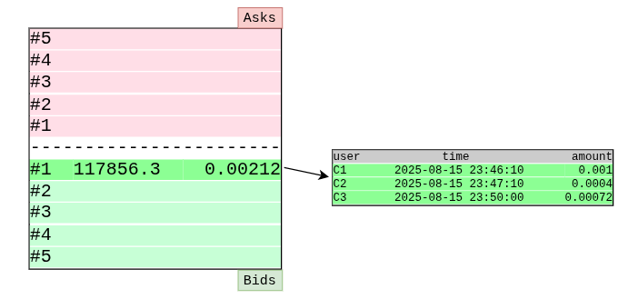
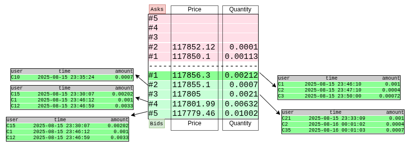

# 📚 Detailed Structure of an Order Book

In this section, we explore the structure of an order book in greater detail. Building upon the previous explanation of the general order book concept, we now dive into the specific elements required for implementation.

---

## 🧱 Price Levels and Order Rows

Each row in the order book represents a **price level**.

Each price level may contain **one or more orders** from different users.

### 📌 Example:

At the price of `117856.32`, we have three sell orders from users C1, C2, and C3:

```shell
C1 → 0.001   BTC → 117856.32 → 2025-08-15 23:46:10
C2 → 0.0004  BTC → 117856.32 → 2025-08-15 23:47:10
C3 → 0.00072 BTC → 117856.32 → 2025-08-15 23:50:00
```


📷 *The image below illustrates an example of an order book.*




---

## 📈 Market Activity and Order Book Dynamics

The rate of change in the order book depends on:
- Market supply and demand
- The number of active users on the exchange

The larger the exchange and the deeper the market, the more frequently the order book updates.  
For example, the `BTC-USDT` market on Binance typically has higher trading volume than other exchanges.

Based on supply and demand, the simulated order book in the image below contains both buy and sell orders.



---

## 🧠 Key Terms

- **Mid Price**: The average between the best bid (highest buy) and best ask (lowest sell) prices.
- **Spread**: The difference between the best bid and best ask prices.

> A smaller mid price or spread indicates a deeper market, meaning buyers and sellers are closely aligned in price.

> This results in tighter price gaps and potentially higher liquidity.

---

## 🏦 Order Book Depth

One of the key factors in evaluating market liquidity is the **volume of orders** present in the order book.

- If the **buy volume** exceeds the **sell volume**, demand may be greater than supply, potentially driving prices upward.
- If the **sell volume** exceeds the **buy volume**, supply may be greater than demand, potentially driving prices downward.

Ultimately, trader behavior shapes the supply and demand dynamics of the market.


